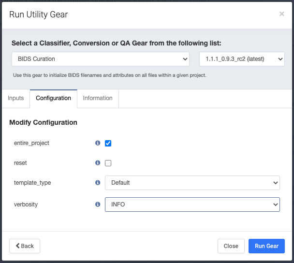

# curate-bids
Flywheel Gear that curates files within a Flywheel project according to BIDS Spec

## Setup
Before running BIDS curation on your data, you must first prepare your data with the following steps:
1. Run the [SciTran: DICOM MR Classifier](https://github.com/scitran-apps/dicom-mr-classifier) gear on all the acquisitions in your dataset
    * This step extracts the DICOM header info, and store it as Flywheel Metadata.
1. Run the [DCM2NIIX: dcm2nii DICOM to NIfTI converter](https://github.com/flywheel-apps/dcm2niix) gear on all the acquisitions in your dataset
    * This step generates the Nifti files that fMRIPrep needs from the DICOMS.  It also copies all flywheel metadata from the DICOM to the Nifti file (In this case, all the DICOM header information we extracted in step 1)
1. Only then can you run this gear on the project.  More information about BIDS Curation on Flywheel can be found [here](https://docs.flywheel.io/hc/en-us/articles/360008162154-BIDS-Overview) and running this curation gear is described [here](https://docs.flywheel.io/hc/en-us/articles/360009218434-BIDS-Curation-Gear).  If you need to rename sessions or subjects before curation, you may find the gear helpful: [bids-pre-curate](https://github.com/flywheel-apps/bids-pre-curate).

## Inputs

No inputs need to be set for this gear.  By default, it will step through the entire project and look at all subjects and sessions.  If the "entire_project" configuration parameter (see below) is un-checked, it will only step through the current session.

## Config

### entire_project

Run bids curation on the entire project.  If this is *not* checked, curation will take place on only the currently selected subject.  Default (when decked) is to run on entire project.

### reset

Remove all BIDS info from files before curating.  Default is unchecked, to not reset the curation.

Warning: if you have manually selected any container or file to be ignored by checking the "bids ignore" flag in the BIDS info, this will remove that also, so you will need to do that again if it is important to you.  As an alternative to using that ignore flag, you can add "_ignore_BIDS" to the end of an acquisition container's name, and it will be ignored even if it is re-curated with the reset flag checked.  This behavior is only for the Default template and for acquisitions.  Similar behavior can be had by using a custom template.

### template_type

Which template type to use. Options: Default, ReproIn, or Custom. Note: Custom expects a BIDS Project Curation JSON Template as a project-level file with the filename ending in project-template.json.

### verbosity

This defaults to INFO but set it to DEBUG to see exactly what is happening to help with figuring out BIDS curation.

## Outputs

The "outputs" of this gear are metadata written to the "BIDS" namespace in all container's and file's Custom Information.  See the [BIDS Introduction](https://docs.flywheel.io/hc/en-us/articles/360008162154-BIDS-Overview) for more information.
